#### __Risk Management__ 

# Group Work Project 1

## Problem and Overview of Bayesian networks

### Problem Statement:

Crude oil prices form one of the key indicators in the global economy, attracting a lot of attention and focus by governments and businesses alike to predict the future trend of these prices. Doing so has always been difficult, considering that crude prices are extremely sensitive to various global demand and supply disruptions. Variables include geopolitical tensions, patterns of economic growth, technology advances, and environmental concerns, among others that all play a part in contributing to this complex interplay that results in the erratic price of oil that is extremely hard to predict.

Bayesian networks are one of the most effective tools, concerning long-run forecasting of oil prices. They excel in capturing complex relationships and uncertainties inherent in economic and market dynamics, incorporating insights from the current and anticipated state of the oil market. These networks facilitate a comprehensive exploration of all pertinent elements in decision-making by visualizing underlying probability structures and adapting to evolving conditions over extended periods.

With their ability to integrate far-reaching datasets on geopolitical developments, economic indicators, and technological and environmental issues, Bayesian networks provide a robust framework for developing innovative models. This adaptability is crucial for accurately reflecting the rapid changes in market conditions that can occur within months due to new geopolitical events or technological advancements.

This work aims to offer a practical framework for decision-making within the global economy by addressing the complexities involved in forecasting the price of crude oil. Through the application of Bayesian networks, the goal is to enhance the reliability and insightfulness of long-term crude oil price forecasts, thereby supporting strategic economic decisions.

## Suitability of Bayesian networks for oil price forecasting

1. Dealing with uncertain and complex relationships: Estimating the price of crude oil requires considering a wide range of interrelated macroeconomic, geopolitical, and market variables. When modeling complex structures with several variables and uncertain interactions, Bayesian networks perform exceptionally well. According to the thesis, the complex relationship of global economic factors determines the price of crude oil. This covers the quantity of oil produced by nations like those in OPEC, the quantities of oil used by the developed economies (OECD), and the continuous political and economic developments that take place globally. Bayesian networks are perfect for depicting the complexities of the oil market because they can capture these complicated interactions and interdependence amongst the variables within a graphical structure.

2. Understanding the market structure: One of the primary issues addressed in the thesis is understanding the workings of the oil markets. Bayesian networks are capable of learning a model's structure and parameters from its data. The paper explores two primary methodologies for structure learning using Bayesian networks:

   a) Constraint-based learning: This method uses statistical tests to discover conditional independencies amongst variables and then builds a network that fulfills the constraints.

   b) Score-based learning: This approach examines a set of alternative graph topologies to discover the one that best matches the data based on a scoring system. 

3. Addressing inaccurate, missing, or incomplete economic and financial information often results in noise. Given that Bayesian networks can execute probabilistic inference with imperfect knowledge, they are resilient to noisy or incomplete data. Due to this, they are especially well-suited for practical uses in financial markets, where data quality might fluctuate.

4. Including domain information: Domain expertise can be incorporated into the model using Bayesian networks. This means that domain knowledge from market specialists, energy strategists, and economists can be added to the prior probability or network structure in light of oil price predictions. Expert insight and data-driven learning together have the potential to produce models that are more precise and understandable.

5. Probabilistic estimations: Bayesian networks, as opposed to deterministic models, produce probabilistic estimates, which are more valuable for making decisions in unpredictable contexts like financial markets. The goal of the thesis is to present an accurate crude oil price estimate, and belief networks can offer probability distributions and confidence intervals for future oil prices in addition to point estimates.
6. Causality: Analyzing the nuances of the oil market requires the ability to depict causal linkages between variables, something Bayesian networks can provide. The aim of establishing a probabilistic graphical model to illustrate the motion of the oil market and establish the causal link between these many variables is addressed in the paper. In the energy industry, this causal reasoning capacity can help with making policies and strategic choices by enabling better interpretation of models.

7. Resilience towards fresh data: When new data is accessible, Bayesian networks may be adjusted effectively. This is especially crucial in the oil industry, which is changing swiftly and is susceptible to price changes due to market trends, geopolitical events, and new economic data. Bayesian networks are well-suited for keeping forecasts current because of their capacity to integrate new information and change probability.

8. Managing numerous time scales: A variety of time-scale elements, ranging from short-term supply interruptions to long-term changes in the economy, have an impact on the oil market. Bayesian networks can describe temporal relationships and produce multi-quarter predictions, especially when paired with methods like the Dynamic Bayesian Networks or the Hidden Markov Models.

9. Research and application: A further issue described in the paper is the research and exploitation of existing data and learned structures for forecasting oil market behavior. Belief networks are appropriate for this purpose because they can effectively execute inference on the structure, enabling both variable exploration and prediction.

10. Model credibility: The paper goes on to discuss ways to validate the developed model's performance and dependability. Bayesian networks offer a variety of model validation techniques, like cross-validation, sensitivity analyses, and posterior predictive checks. These strategies can aid in determining the of the model and credibility before implementation in financial markets.

11. In contrast to certain black box neural network algorithms, Bayesian networks show the correlations between variables graphically. This interpretability is critical for financial applications, whereby understanding the logic behind forecasts is sometimes as essential as the estimates themselves. The paper seeks to gain insight into the operations of the oil markets and the belief networks aid this purpose by offering perspectives on the market's structure and behavior.

12. Nonlinear connections amongst the variables are common in oil pricing. Bayesian networks may capture these nonlinear relationships using conditional probability tables and continuous distributions, resulting in a more accurate picture of the oil market's complex relations.

13. With the Bayesian networks, variables may be easily manipulated to perform hypothetical studies and stress tests. This is consistent with the paper's purpose of replicating economic hardship scenarios to test the model's dependability. Analysts can investigate how alternative scenarios may affect oil prices and evaluate how the model performs under various situations by modifying the values or probability of specific variables. The paper addresses using data from a variety of sources, such as the Energy Information Administration (EIA) and the Federal Reserve Economic Data (FRED). Bayesian networks may successfully integrate information from numerous sources, merging disparate datasets to create one unified model of the oil market. Due to the many factors impacting the price of oil, the issue naturally requires data that is highly dimensional. Bayesian networks can effectively produce and infer highly dimensional probability distributions, which makes them ideal for this challenging forecasting challenge.

## Data

### Extreme Outlier Treatment

We have collected data from the IMF and World Bank and different sources. We must look for outliers in our data to avoid undue influence of any single event on our model. Here, we have decided to incorporate an Isolation forest for outlier treatment.

Isolation forest is suitable for High dimensional data such as our dataset, it works by creating random decision trees, which separate outliers from normal data points.

Following are the Steps that are followed - 
1. Isolation tree construction -  each tree is constructed using a random subset of data, and then grown using the randomly selected feature and split value between the min and max value of that feature.
2. Path length - path length is calculated from the root node, shorter paths tend to lead to outlier data points. 
3. Ensemble of tree - multiple trees are constructed to form a forest and then the average path length is calculated.
4. Score calculation - anomaly score is calculated using average path length, points with shorter paths and higher scores are considered outliers.

code for implementation - 
```python
def treat_outliers_isolation_forest(df, contamination=0.01):
    iso_forest = IsolationForest(contamination=contamination, random_state=42)  
    df_out = df.copy()
    
    for column in df.columns:
        if df[column].dtype in ['int64', 'float64']:  
            not_nan = df[column].dropna()
            outliers = iso_forest.fit_predict(not_nan.values.reshape(-1, 1))
            df_out.loc[not_nan.index, column] = np.where(outliers == -1, np.nan, not_nan)
    
    return df_out
```

Image depicting how ISolation forest works


### Bad Data Treatment
[STUDENT B TO WRITE]

### Treatment of Missing Values

Some datasets primarily the political stability data was collected on a yearly basis. Therefore, to address this limitation, we adopted the linear interpolation methodology to transform the dataset from a yearly resolution to a daily resolution. 

Mathematically, linear interpolation can be expressed as follows:

$$y = y_1 + \frac{(x - x_1)(y_2 - y_1)}{(x_2 - x_1)}$$

Where:
-$(x_1, y_1)$ and $(x_2, y_2)$ are the known data points,
-$x$ is the point at which the value is to be estimated,
-$y$ is the interpolated value at $x$.

In the context of our study,$x$ represents the date for which the value is being interpolated, and $y$ represents the corresponding data value.

The interpolation process ensures a smooth transition between data points, effectively approximating the daily values while maintaining the overall trend and seasonality inherent in the original yearly data. The result is a finely granulated dataset suitable for detailed analysis and modeling.

The following code achieved this:

```python
def interpolate_data (df, method:str):
    return pl.DataFrame(
        {
            "period": pl.date_range(df["period"].min(), df["period"].max(), '1d', eager=True).alias('period'),
        }
    ).join(df, on="period", how="left").with_columns(pl.exclude('period').interpolate("linear"))
```

## Data Visualisation

### Time Series Plots

The time series plots are shown as follows:


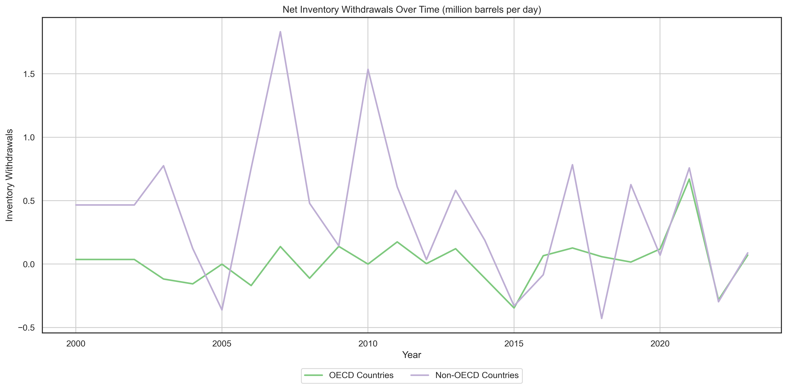
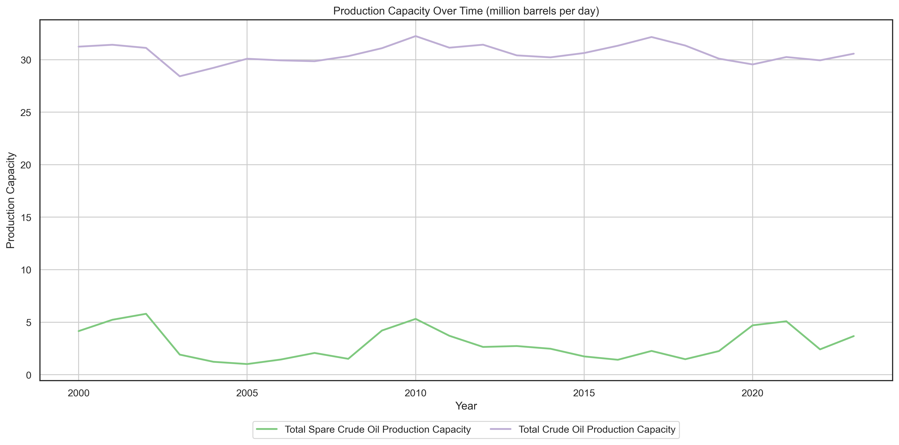

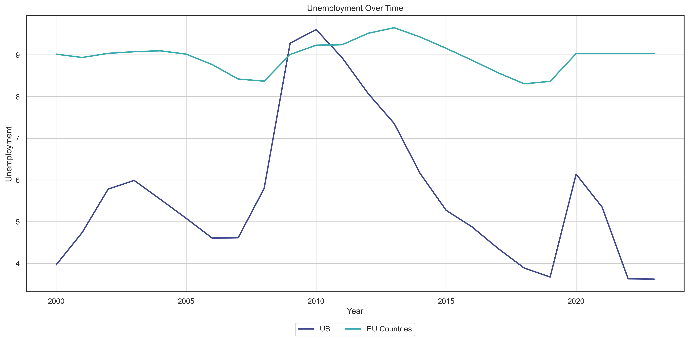


### Distributional and Multivariate Kernel Density Plots
In our study, we subsetted the highly correlated variables to enhance the clarity and interpretability of the multivariate density plots. The plots are presented as follows:


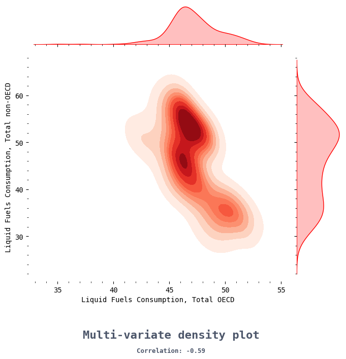

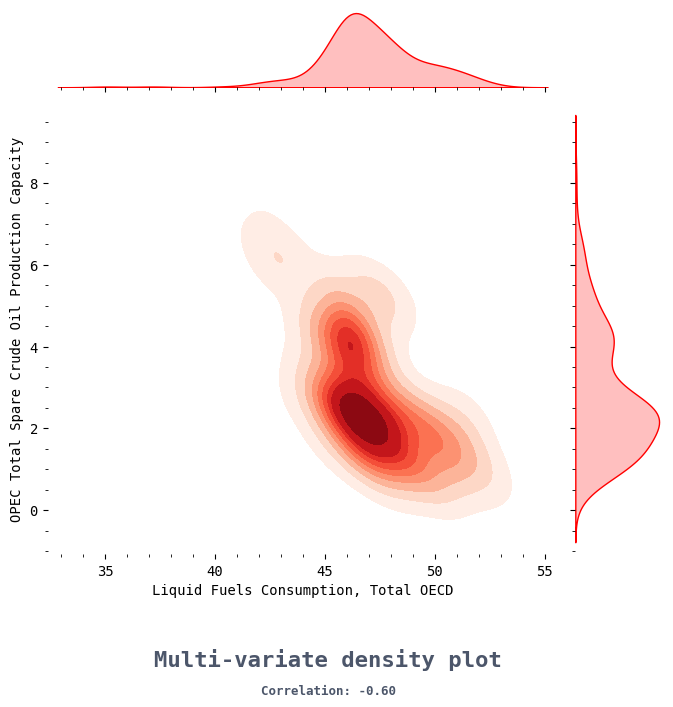

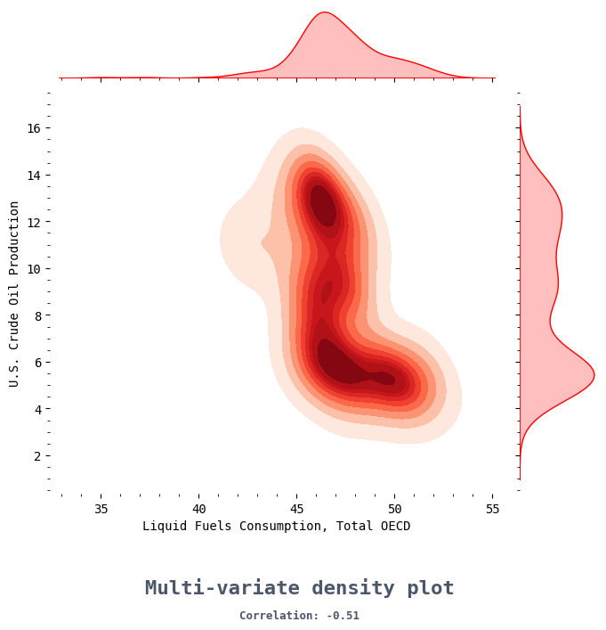
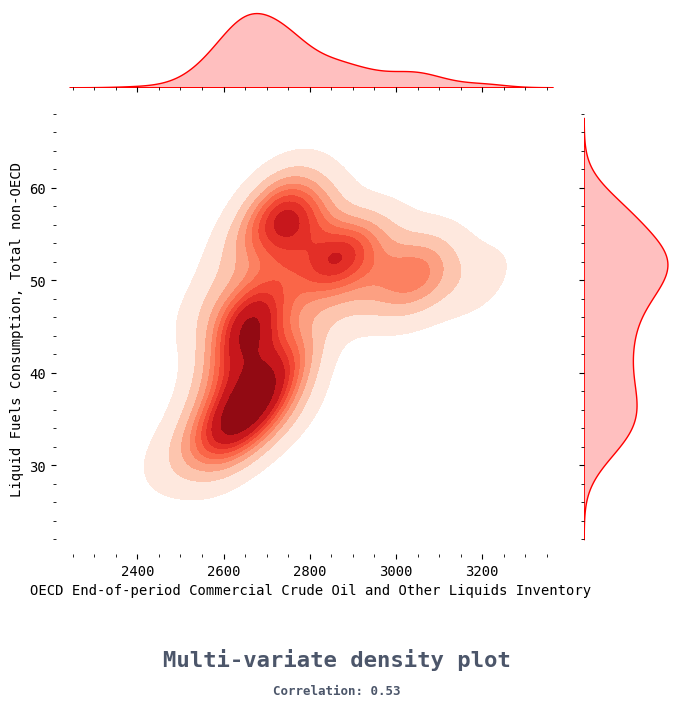


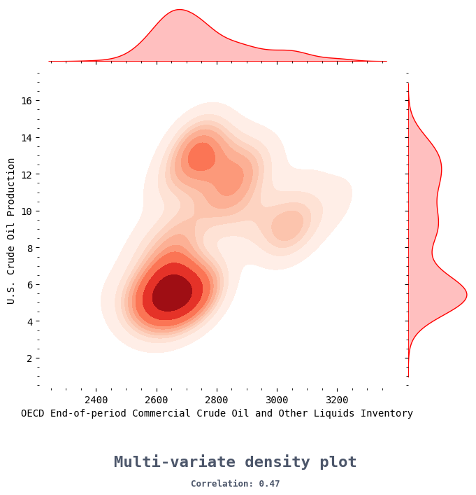


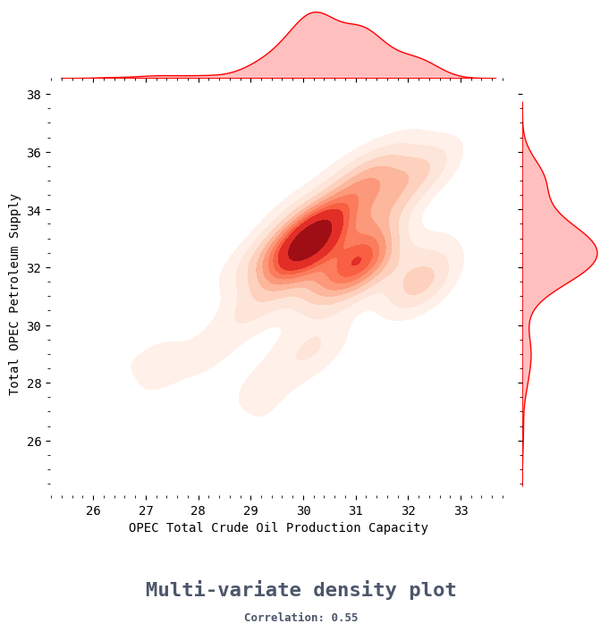
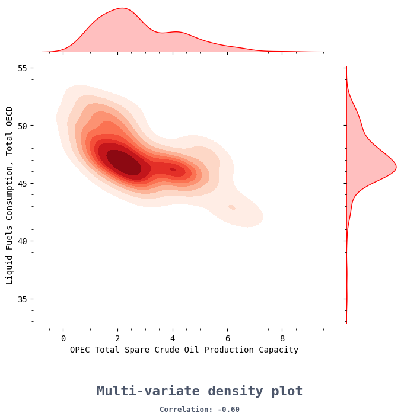
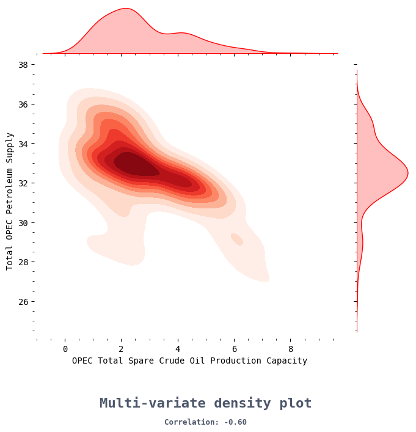
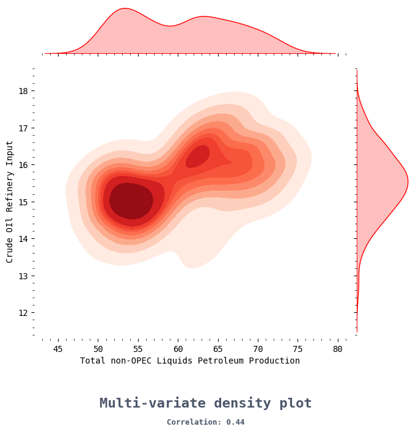
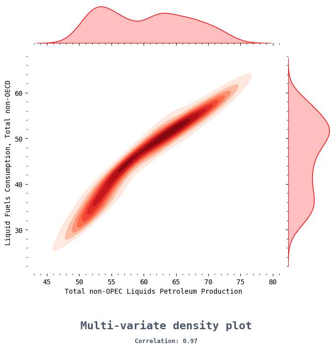


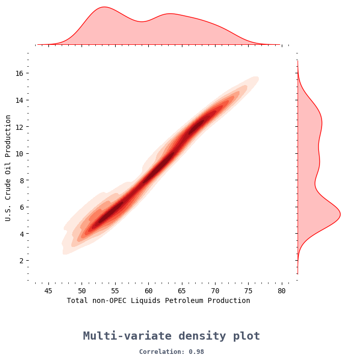
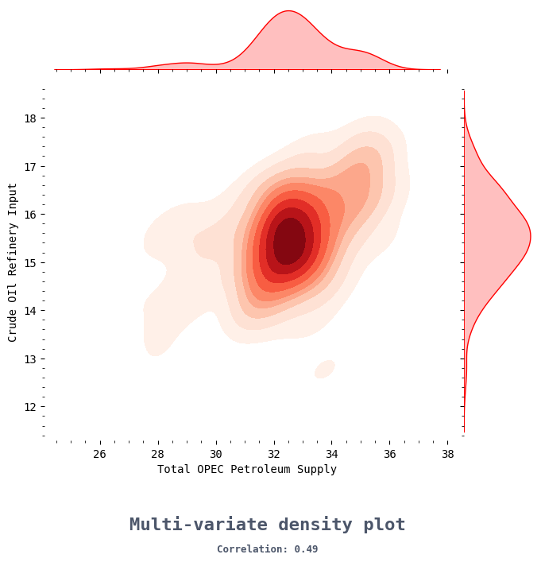


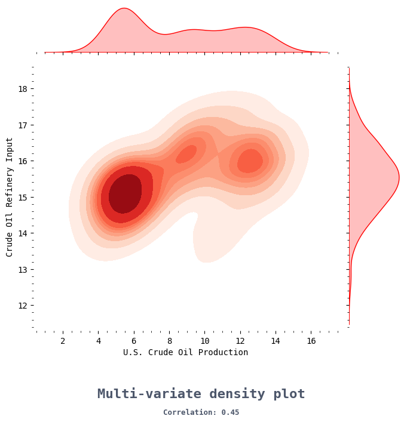

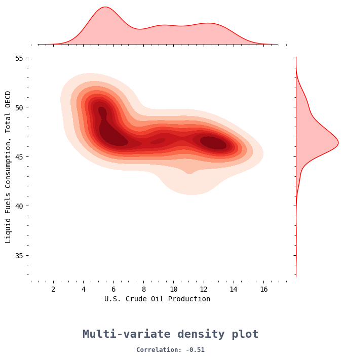
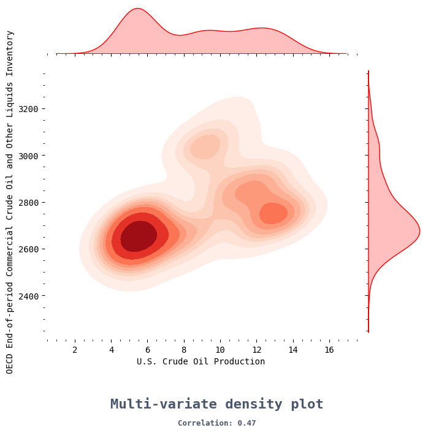


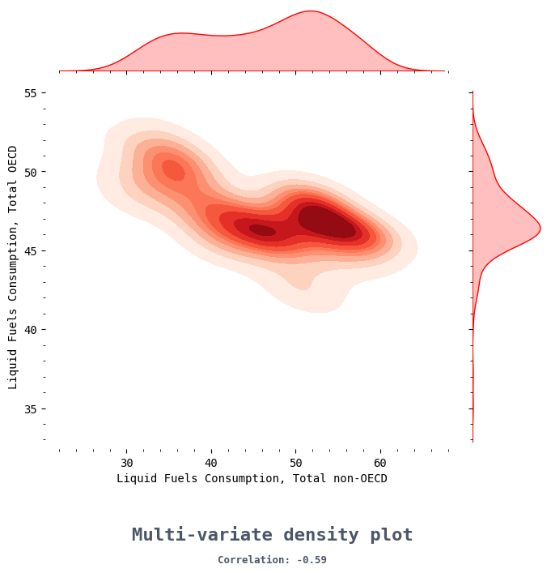


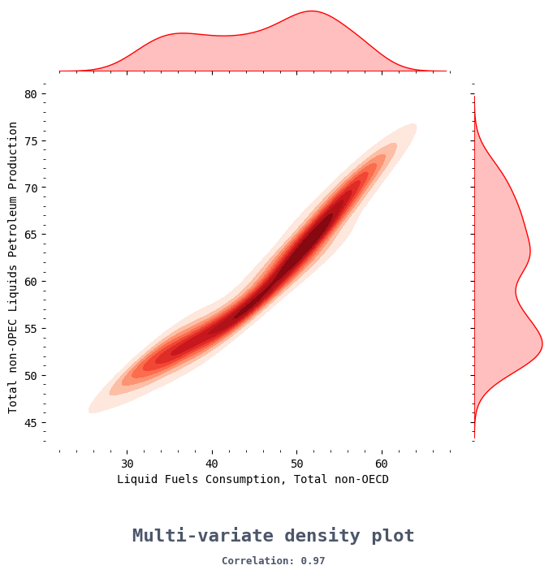


## Oil Prices
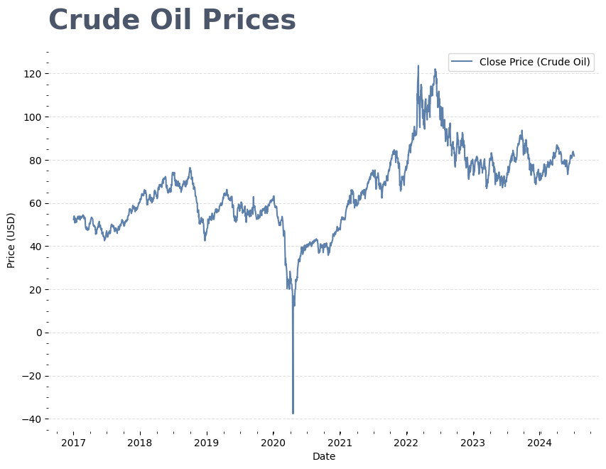

Oil prices exhibit significant volatility clustering, a phenomenon characterized by periods of high and low volatility. 


The PACF of oil prices reveals that significant autocorrelations taper off after lag 3, indicating that each oil price return is directly influenced by its immediate three preceding returns (when controlled for preceding lags), with minimal direct effect beyond this horizon.


## Model

### Probabilistic Graphical Models

PGMs utilize graphs to represent complex multivariate probability distributions, capturing the conditional independence of random variables. Drawing from domains like subsets and cliques, graph-related knowledge plays a crucial role in enhancing PGMs.
The combination of Graph Theory and Probability Theory leads to the development of well-defined and computationally efficient models. PGMs are formed by linking a graphical structure with variables in a probabilistic model, effectively depicting relationships, uncertainties, and conditional dependencies among variables.
PGMs provide visual representations and insights into model structure. A deep understanding of a PGM's graph facilitates tasks such as inference and parameter estimation. DGMs such as Bayesian Networks and UGMs such as Markov Random Fields are subsumed under PGMs.

#### Bayesian Networks

Bayesian Networks also referred to as Belief Networks or Bayesian Belief Networks, represent independence assumptions in a probabilistic distribution. These networks are mainly used to illustrate causal connections among random variables. For example, consider a scenario where a car fails to start. A belief network can display potential reasons such as a dead battery or a faulty ignition system leading to the observed starting failure. In this example, the dead battery and faulty ignition are causes, and the car's failure to start is the observation.

Graphical models are used by Belief Networks to show how probabilities are related. In these networks, random variables are represented by nodes in a directed graph, and direct dependencies are shown by edges. This visual method helps in understanding cause-and-effect relationships in a system. For example, when determining if a dog has fleas, observable variables like scratching intensity, hidden variables like molting, and observable variables like hair abundance and the cat's flea history are taken into account. A belief network represents these connections and emphasizes cause-and-effect relationships.

Although the prior probability distribution is not fully specified, belief networks uncover conditional dependencies. Minimal sets of independent conditions are identified using D-separation. In addition to showing direct dependencies, numerical values or functions are needed in the network to explain how variables interact. For instance, a joint probability distribution, P(A,B,C,D,E), can be shown as a product of conditional probabilities.
P(A) P(B|A) P(C|B,A) P(D|C,B,A) P(E|D,C,B,A).

The representation can be simplified with conditional dependencies, such as P(A,B,C,D,E) = P(A) P(B|A) P(C|A) P(D|B) P(E|D,B). It's important to directly link this format to a specific belief network. Creating a belief network includes establishing nodes for each factor in the probability product and connecting them to their dependent nodes. For example, P(C|A) corresponds to a node linked to node A, and P(E|D,B) includes directed edges from nodes D and B to node E.

#### Comparison with Markov

Similar to Bayesian networks, Markov Random Fields (MRFs) are used to illustrate the connections between random variables using a visual representation. However, unlike Bayesian networks, MRFs utilize undirected edges instead of directed edges. Additionally, MRFs can include cycles, which is different from Bayesian Networks. Consequently, MRFs can represent different dependency relationships when compared to their Bayesian network counterparts. It's important to note that MRFs do not fully encompass Directed Graphical Models (DGMs) since there are connections, such as causal relationships, that only DGMs can express.

Both Bayesian Networks and Markov Random Fields (MRFs) are types of graphical models used to portray probability distributions, but they represent different probabilistic relationships. Bayesian networks use edges to show conditional dependencies between variables, whereas MRFs use undirected edges to indicate joint probabilities of cliques within the graph.

For example, consider an MRF graph. The undirected edges convey the probabilities of groups of connected variables, which are known as cliques. The arrangement of these cliques is instrumental in understanding joint probabilities within the system.

Bayesian Networks and Markov Random Fields have similarities, but they are not interchangeable as they capture different kinds of probabilistic relationships. Removing arrow directions from a Bayesian Network to convert it to an MRF would be incorrect because Directed Graphical Models in Bayesian Networks and Undirected Graphical Models in MRFs represent distinct independent relationships. The equivalence between these models is not straightforward due to their differing independence semantics. Both models can represent probability distributions, but they handle conditional and joint dependencies in different ways. It's crucial to select the appropriate model based on the nature of the probabilistic relationships you aim to capture in your specific problem domain.

### Parameter Learning
[STUDENT B TO WRITE]

### Markov Chains and Blankets

##### Key Concept 1: Markov Property

$$
\begin{align}
P\left[\underbrace{X_{t+1}=j}_{\text{Future state}} \mid \underbrace{X_t=i}_{\text{Present state}}, \underbrace{X_{t-1}=k, \cdots, X_0=m}_{\text{Past states}}\right] \\
= P\left[\underbrace{X_{t+1}=j}_{\text{Future state}} \mid \underbrace{X_t=i}_{\text{Present state}}\right] 
= \underbrace{p_{i j}}_{\text{Transition probability}}
\end{align}
$$

1. This property implies that once the present state is known, the past states do not provide any additional information about the future state.
2. This property implies that once the present state is known, the past states do not provide any additional information about the future state.
3. The behavior of a Markov process can be fully described by specifying the transition probabilities $P(X_{t+1} = j \mid X_t = i)$ for all pairs of states $i, j \in S$. The set $S$ contains all possible states the process can occupy. This set is countable, meaning it can be finite or countably infinite.

> Any stochastic process that follows the Markov property is known as Markov Chain.


#### Key Concept 2: Hidden Markov Model

###### 1. Hidden State  

$$ Q = \{q_1, \cdots, q_N\} $$ 
This is a finite set of $N$ states. These states are not directly observable and are considered "hidden." For example: The market can be in different states, such as a bull market (rising prices) or a bear market (falling prices). These regimes are inherently unobservable. 

###### 2. Observable Outputs
These hidden states generate observable outputs or symptom such as falling or rising spot prices:   $\Sigma = \{s_1, \cdots, s_M\}$

###### 3. Initial Probability Vector
Hidden states are associated are associated with an initial probability vector: 
$$\Pi = \{\pi_i\} \qquad \text{such that} \qquad \sum_{i=1}^{N} \pi_i = 1$$
This represents the initial probability of the market being in a bull or bear market. For instance, based on historical data, there may be a higher probability of starting in a bull market.

###### 4. State transition probability matrix
$$   A = \{a_{ij}\}   $$
This is the state transition probability matrix. The element $a_{ij}$ represents the probability of transitioning from state $q_i$ to state $q_j$. The probabilities for transitions from any given state must sum to 1:   $\sum_{j=1}^{N} a_{ij} = 1 \quad \forall i \in Q$. This represents the probability of transitioning from one market regime to another. For example, the probability of transitioning from a bull market to a bear market or staying in the same market regime.

###### 5. Emission Probability Matrix   $B = \{b_i(v_k)\}$
This is the emission probability matrix. The element $b_i(v_k)$ represents the probability of observing symbol $v_k$ when in state $q_i$. The probabilities for observing all possible symbols from any given state must sum to 1:   $\sum_{k=1}^{M} b_i(v_k) = 1 \quad \forall i \in Q$. This represents the probability of observing specific market returns and financial indicators given a particular market regime. For example, the probability of observing positive returns and high trading volume in a bull market.

> **Combining these key ideas, the Hidden Markov Model can be specified as a 5-tuple $(Q, \Sigma, \Pi, A, B)$** 


#### Key Concept 3: Directed Acyclic Graph

**What is directed?**
Edges have a direction (from one vertex to another).
```
A → B → C → D → E
```

**What are cycle?**
A cycle refers to a path in the graph that starts and ends at the same vertex, following the direction of the edges.
```
   A <---
   ↓    |
   B → C
   ↓    |
   D ---'

```

Therefore, DAG is directed and has no cycles.


#### Key Concept 4: Representation of HMM as DAG

**Nodes:**
1. **Hidden State Nodes**: Represent the hidden states $q_1, q_2, \ldots, q_N$.
2. **Observable Symbol Nodes**: Represent the observable symbols $s_1, s_2, \ldots, s_M$
**Edges**:
  - **Transition Edges**: Directed edges between hidden state nodes $q_i$ and $q_j$ with weights $a_{ij}$ representing transition probabilities.
  - **Emission Edges**: Directed edges from hidden state nodes $q_i$ to observable symbol nodes $s_k$ with weights $b_i(v_k)$ representing emission probabilities.

With two hidden states (q1 and q2) and three observable symbols (s1, s2, s3), the DAG might look like this:

- **Hidden States**:
  -$q1$ and $q2$ are represented as nodes.
  -$q1$ has an edge to $q2$ with weight $a_{12}$.
- **Observable Symbols**:
  - $s1, s2,$ and $s3$ are represented as nodes.
  - $q1$ emits $s1, s2,$ and $s3$ with probabilities $b_1(s1), b_1(s2), b_1(s3)$.
  - $q2$ emits $s1, s2,$ and $s3$ with probabilities $b_2(s1), b_2(s2), b_2(s3)$.

#### Markov Blanket

For a node $v$, its Markov Blanket $MB(v)$ consists of:
  1. **Parents of $v$**: Nodes directly connected to $v$ with incoming edges.
  2. **Children of $v$**: Nodes directly connected to $v$ with outgoing edges.
  3. **Parents of children of $v$**: Nodes that are parents of any child node of $v$.

If $v$ represents a patient's health condition, its Markov Blanket might include:
  - Tests (nodes that cause $v$),
  - Symptoms (children of $v$),
  - Other conditions that can cause the same health condition (parents of children of $v$).

### Step 10
#### Pseudocode

Algorithm: Inferred Causality Detection
Input: Dataset with variables {X1, X2, ..., Xm}
Output: Partially directed acyclic graph (PDAG)

Step 1: Determine Markov Blankets
  For each variable Xi in the dataset:
    Compute the Markov blanket of Xi
    Filter out any false positives by removing asymmetric Markov blankets

Step 2: Identify Neighbors
  For every pair of variables (Xi, Xj):
    Find set SXiXj where Xi and Xj are conditionally independent given SXiXj, and neither Xi nor Xj are in SXiXj
    If no such SXiXj exists:
      Add an undirected edge between Xi and Xj
    Utilize Markov blankets B(Xi) and B(Xj) from Step 1 to restrict the search space for SXiXj to the smaller sets B(Xi)\Xj and B(Xj)\Xi
    Adjust any inconsistently directed edges

Step 3: Determine Arc Directions
  For each pair of non-adjacent variables (Xi, Xj) with a common neighbor Xk (where k is not in SXiXj):
    Set directions of arcs to create a v-structure, with Xi → Xk and Xk → Xj
  Apply the following rules to orient any remaining undirected edges:
    a) If a directed path exists from Xi to Xj, then direct edge Xi → Xj
    b) If Xi → Xk and Xk → Xj, then direct edge Xk → Xj


### Reference 

Ross, S. (November 2023). How Do Companies Forecast Oil Prices? Investopedia. Available at: https://www.investopedia.com/articles/investing/101215/how-do-companies-forecast-oil-prices.asp.

Perry, G. L. (August 2013). Why is the Price of Oil so Hard to Predict? Brookings. Available at: https://www.brookings.edu/articles/why-is-the-price-of-oil-so-hard-to-predict/.

Lee, C.-Y., & Huh, S.-Y. (January 2017). Forecasting Long-Term Crude Oil Prices Using a Bayesian Model with Informative Priors. Sustainability, 9(2), 190. Available at: https://doi.org/10.3390/su9020190.

Ohri, A. (February 2021). Bayesian Belief Networks: An Introduction. U-Next Courses. Available at: https://u-next.com/blogs/data-science/bayesian-belief-network/.